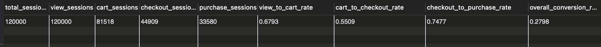
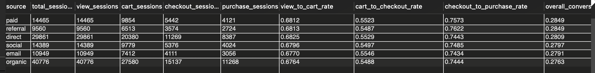
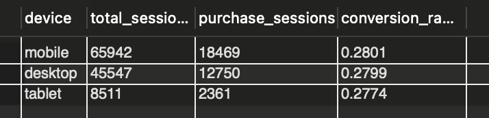
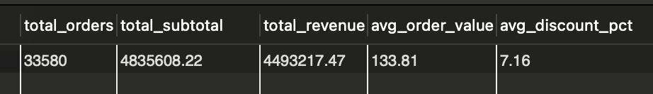
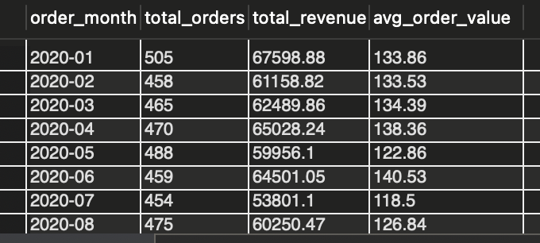
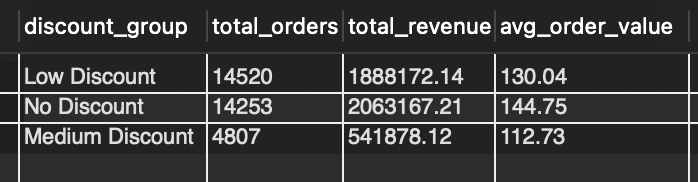
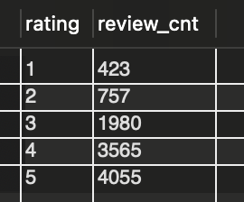
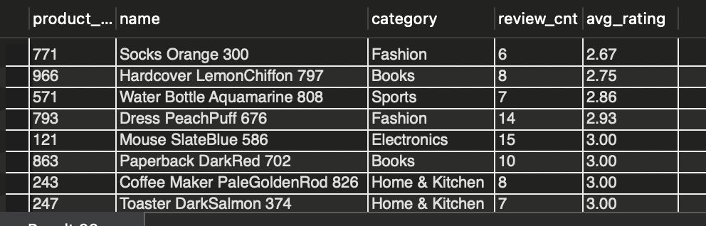
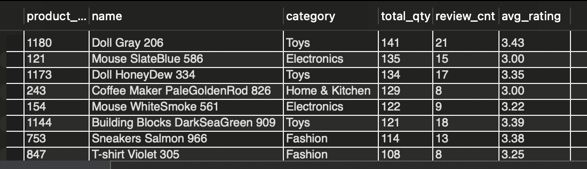

# E-commerce data analysis with MySQL
E-commerce transactions, clickstream, data resource: [E-commerce data](https://www.kaggle.com/datasets/wafaaelhusseini/e-commerce-transactions-clickstream/data).

## ! Attention plz: 
The data is generated by a simulation system, which may not reflect the real-world situation, and the project is for my learning purpose only.

In this simple project, we will analyze the e-commerce data using MySQL. We will perform various queries to extract insights from the data, such as conversion rates, popular products, and customer behavior patterns. That's a great way to understand the logic under customers' behavior and make informed business decisions.

## 0. Clean the data
In *events.csv*, there may exist some duplicate records due to the internal system errors. We can use the following SQL query to remove duplicates:

```sql
# reduce repetition
CREATE OR REPLACE VIEW events_dedup AS
SELECT
    event_id,
    session_id,
    timestamp,
    event_type,
    product_id,
    qty,
    cart_size,
    payment,
    discount_pct,
    amount_usd
FROM (
    SELECT *,
           ROW_NUMBER() OVER (
               PARTITION BY session_id, timestamp, event_type, product_id
               ORDER BY event_id
           ) AS rn
    FROM events
) t
WHERE rn = 1;
# check rows before and after
SELECT 
    (SELECT COUNT(*) FROM events) AS raw_events,
    (SELECT COUNT(*) FROM events_dedup) AS dedup_events;
```
## 1. Analyze conversion rates(funnel analysis)
### Global conversion rates
``` sql
# conversion
WITH session_funnel AS (
    SELECT
        session_id,
        MAX(CASE WHEN event_type = 'page_view' THEN 1 ELSE 0 END) AS has_view,
        MAX(CASE WHEN event_type = 'add_to_cart' THEN 1 ELSE 0 END) AS has_cart,
        MAX(CASE WHEN event_type = 'checkout' THEN 1 ELSE 0 END) AS has_checkout,
        MAX(CASE WHEN event_type = 'purchase' THEN 1 ELSE 0 END) AS has_purchase
    FROM events_dedup
    GROUP BY session_id
)
SELECT
    COUNT(*) AS total_sessions,
    SUM(has_view) AS view_sessions,
    SUM(has_cart) AS cart_sessions,
    SUM(has_checkout) AS checkout_sessions,
    SUM(has_purchase) AS purchase_sessions,
    ROUND(SUM(has_cart) / SUM(has_view), 4) AS view_to_cart_rate,
    ROUND(SUM(has_checkout) / SUM(has_cart), 4) AS cart_to_checkout_rate,
    ROUND(SUM(has_purchase) / SUM(has_checkout), 4) AS checkout_to_purchase_rate,
    ROUND(SUM(has_purchase) / SUM(has_view), 4) AS overall_conversion_rate
FROM session_funnel;
```
And get the rates here



(Visualization may go here...)

From the above results, we can see that the conversion is lowest between add to cart and checkout, which indicates that there may be some issues in the checkout process that are causing customers to abandon their carts. Possible reasons could include a complicated checkout process, unexpected costs (like shipping fees), unsatisfied vouchers, or limited payment options. To improve the conversion rate, we can promote sales activities such as getting more vouchers when reaching specific price, considering simplifying the checkout process, providing clear information about costs upfront, and offering multiple payment options.

### Conversion rates by source type
Shopping platform often provide different promotions for different customers and eshops. There are examples: 
- paid: platform promotion, google ads, facebook ads which are paid by the eshop
- referral: flow coming from other websites, blogs or people sharing the link
- direct: users who directly visit the website by typing the URL or using bookmarks
- social: flow from social media platforms such as fb, ig, ytb
- email: flow from email promotions
- organic: flow from search engines without paid ads

```sql
# conversion by different source
WITH session_funnel AS (
    SELECT
        s.source,
        e.session_id,
        MAX(CASE WHEN e.event_type = 'page_view' THEN 1 ELSE 0 END) AS has_view,
        MAX(CASE WHEN e.event_type = 'add_to_cart' THEN 1 ELSE 0 END) AS has_cart,
        MAX(CASE WHEN e.event_type = 'checkout' THEN 1 ELSE 0 END) AS has_checkout,
        MAX(CASE WHEN e.event_type = 'purchase' THEN 1 ELSE 0 END) AS has_purchase
    FROM events_dedup e
    JOIN sessions s
      ON e.session_id = s.session_id
    GROUP BY s.source, e.session_id
)
SELECT
    source,
    COUNT(*) AS total_sessions,
    SUM(has_view) AS view_sessions,
    SUM(has_cart) AS cart_sessions,
    SUM(has_checkout) AS checkout_sessions,
    SUM(has_purchase) AS purchase_sessions,
    ROUND(SUM(has_cart) / NULLIF(SUM(has_view), 0), 4) AS view_to_cart_rate,
    ROUND(SUM(has_checkout) / NULLIF(SUM(has_cart), 0), 4) AS cart_to_checkout_rate,
    ROUND(SUM(has_purchase) / NULLIF(SUM(has_checkout), 0), 4) AS checkout_to_purchase_rate,
    ROUND(SUM(has_purchase) / NULLIF(SUM(has_view), 0), 4) AS overall_conversion_rate
FROM session_funnel
GROUP BY source
ORDER BY overall_conversion_rate DESC;
```



From the above results, we can see that the conversion rates differ slightly by source type, but the flow differs significantly. For example, the paid source has the highest overall conversion rate, which indicates that the platform promotion and paid ads are effective in driving conversions. On the other hand, the referral and social source has a relatively high conversion rate, which suggests that customers coming from other websites may be as engaged or interested in making a purchase, meanwhile referral gets the smallest flow. However, the lowest conversion rate happens on organic source, which brings the largest flow to the shopping platform. To improve conversion rates for organic traffic, we can consider investing more money on ads, optimizing our SEO strategies, creating high-quality content, and ensuring that the landing pages for organic flow are relevant and engaging.

### Conversion rates by device type
We can also analyze the conversion rates by device type, which can help us understand how customers interact with the platform on different devices and optimize the user experience accordingly. 
- mobile
- desktop
- tablet
  
```sql
# conversion by different device
WITH session_funnel AS (
    SELECT
        s.device,
        e.session_id,
        MAX(CASE WHEN e.event_type = 'page_view' THEN 1 ELSE 0 END) AS has_view,
        MAX(CASE WHEN e.event_type = 'add_to_cart' THEN 1 ELSE 0 END) AS has_cart,
        MAX(CASE WHEN e.event_type = 'checkout' THEN 1 ELSE 0 END) AS has_checkout,
        MAX(CASE WHEN e.event_type = 'purchase' THEN 1 ELSE 0 END) AS has_purchase
    FROM events_dedup e
    JOIN sessions s
      ON e.session_id = s.session_id
    GROUP BY s.device, e.session_id
)
SELECT
    device,
    COUNT(*) AS total_sessions,
    SUM(has_purchase) AS purchase_sessions,
    ROUND(SUM(has_purchase) / COUNT(*), 4) AS conversion_rate
FROM session_funnel
GROUP BY device
ORDER BY conversion_rate DESC;
```
It's not hard to find that mobile is still provides the largest flow and has the highest conversion rate, which is not surprising because mobile shopping has become increasingly popular among customers and become the daily habit for many people. The conversion rates are similar among 3 device types, while the flow on tablet is significantly smaller than the other two, which means the shopping experience on tablet may need to be enhanced.



## 2. Analyze orders and products
### total orders, revenue, average order value, and average discount percentage
```sql
SELECT
    COUNT(*) AS total_orders,
    ROUND(SUM(subtotal_usd), 2) AS total_subtotal,
    ROUND(SUM(total_usd), 2) AS total_revenue,
    ROUND(AVG(total_usd), 2) AS avg_order_value,
    ROUND(AVG(discount_pct), 2) AS avg_discount_pct
FROM orders;
```


### GMV trend
GMV means  Gross Merchandise Value, which is the total value of merchandise sold over a certain period of time. Analyzing the GMV trend can help us understand the overall performance of the e-commerce platform and identify any seasonal patterns or growth opportunities.
```sql
SELECT
    DATE_FORMAT(order_time, '%Y-%m') AS order_month,
    COUNT(*) AS total_orders,
    ROUND(SUM(total_usd), 2) AS total_revenue,
    ROUND(AVG(total_usd), 2) AS avg_order_value
FROM orders
GROUP BY DATE_FORMAT(order_time, '%Y-%m')
ORDER BY order_month;
```


(Visualization may go here...)

From the above results, we can see that there is a seasonal pattern in the GMV trend, with troughs in spring and summer, especially in July. But there maybe special sales or trends in 2021-07. In global, GMV doesn't show a significant growth or decline trend, which indicates that the overall performance of the e-commerce platform is relatively stable.

## 3. Analyze discounts
### discount invertion
Total situation of discount is shown below.
```sql
SELECT
    CASE 
        WHEN discount_pct = 0 THEN 'No Discount'
        WHEN discount_pct > 0 AND discount_pct < 20 THEN 'Low Discount'
        WHEN discount_pct >= 20 AND discount_pct < 40 THEN 'Medium Discount'
        ELSE 'High Discount'
    END AS discount_group,
    COUNT(*) AS total_orders,
    ROUND(SUM(total_usd), 2) AS total_revenue,
    ROUND(AVG(total_usd), 2) AS avg_order_value
FROM orders
GROUP BY discount_group
ORDER BY total_orders DESC;
```


From the above results, we can see that the majority of orders are made with low discount, which indicates that customers are more likely to make a purchase when there is a discount, but they may not be as sensitive to higher discounts. The total revenue and average order value are higher for orders with no discount, and total orders are higher for orders with low discount, which suggests that offering moderate discounts can be an effective strategy for increasing sales. However, it's important to note that the optimal discount strategy may vary depending on the specific products and target audience.

### conversion under different discount
### useless cause there is no exact discount goods' click & add to cart info
```sql
SELECT
    CASE
        WHEN discount_pct IS NULL OR discount_pct = 0 THEN '0%'
        WHEN discount_pct > 0 AND discount_pct < 10 THEN '0-10%'
        WHEN discount_pct >= 10 AND discount_pct < 20 THEN '10-20%'
        WHEN discount_pct >= 20 AND discount_pct < 30 THEN '20-30%'
        ELSE '30%+'
    END AS discount_group,
    SUM(CASE WHEN event_type = 'page_view' THEN 1 ELSE 0 END) AS page_views,
    SUM(CASE WHEN event_type = 'add_to_cart' THEN 1 ELSE 0 END) AS add_to_carts,
    SUM(CASE WHEN event_type = 'checkout' THEN 1 ELSE 0 END) AS checkouts,
    SUM(CASE WHEN event_type = 'purchase' THEN 1 ELSE 0 END) AS purchases,
    ROUND(
        SUM(CASE WHEN event_type = 'add_to_cart' THEN 1 ELSE 0 END)
        / NULLIF(SUM(CASE WHEN event_type = 'page_view' THEN 1 ELSE 0 END), 0),
        4
    ) AS view_to_cart_rate,
    ROUND(
        SUM(CASE WHEN event_type = 'purchase' THEN 1 ELSE 0 END)
        / NULLIF(SUM(CASE WHEN event_type = 'page_view' THEN 1 ELSE 0 END), 0),
        4
    ) AS view_to_purchase_rate,
    ROUND(
        SUM(CASE WHEN event_type = 'purchase' THEN 1 ELSE 0 END)
        / NULLIF(SUM(CASE WHEN event_type = 'add_to_cart' THEN 1 ELSE 0 END), 0),
        4
    ) AS cart_to_purchase_rate
FROM events
GROUP BY discount_group
ORDER BY discount_group;
```

## 4. Analyze ratings
### ratings distribution
```sql
SELECT
    rating,
    COUNT(*) AS review_cnt
FROM reviews
GROUP BY rating
ORDER BY rating;
```


From the above results, we can see that the majority of ratings are 4 and 5, which indicates that customers are generally satisfied with their purchases. However, there are still a significant number of ratings that are 1, 2, and 3, which suggests that there may be some issues with the products or the customer experience that need to be addressed. To improve customer satisfaction and ratings, we can consider implementing quality control measures, providing better customer support, and actively seeking feedback from customers to identify and address any issues.

### low rating
```sql
SELECT
    p.product_id,
    p.name,
    p.category,
    COUNT(r.review_id) AS review_cnt,
    ROUND(AVG(r.rating), 2) AS avg_rating
FROM reviews r
JOIN products p
  ON r.product_id = p.product_id
GROUP BY p.product_id, p.name, p.category
HAVING COUNT(r.review_id) >= 5
ORDER BY avg_rating ASC, review_cnt DESC
LIMIT 20;
```


### high sales but low rating products
```sql
WITH sales AS (
    SELECT
        oi.product_id,
        SUM(oi.quantity) AS total_qty
    FROM order_items oi
    GROUP BY oi.product_id
),
ratings AS (
    SELECT
        product_id,
        COUNT(*) AS review_cnt,
        AVG(rating) AS avg_rating
    FROM reviews
    GROUP BY product_id
)
SELECT
    p.product_id,
    p.name,
    p.category,
    s.total_qty,
    r.review_cnt,
    ROUND(r.avg_rating, 2) AS avg_rating
FROM products p
JOIN sales s
  ON p.product_id = s.product_id
JOIN ratings r
  ON p.product_id = r.product_id
WHERE r.review_cnt >= 5
 and s.total_qty >= 100 and r.avg_rating <= 3.5
ORDER BY s.total_qty DESC, avg_rating ASC
LIMIT 200;
```


From the above results, we can identify products that have high sales but low ratings, which may indicate that there are issues with the product quality or customer experience that need to be addressed. To improve the ratings for these products, we can consider implementing quality control measures, providing better customer support, and actively seeking feedback from customers to identify and address any issues. Additionally, we can consider offering incentives for customers to leave reviews, such as discounts on future purchases or entry into a prize draw, which can help increase the number of reviews and provide more feedback for improvement.

## Total summary
In this project, we analyzed e-commerce data using MySQL to gain insights into customer behavior, conversion rates, orders, discounts, and ratings. The global sales pattern is mature and stable, We found that the conversion rates differ by source type and device type, with mobile showing the highest conversion rate. We also identified seasonal patterns in GMV and found that moderate discounts can be effective in increasing sales. Additionally, we analyzed ratings and identified products with high sales but low ratings, which may indicate issues with product quality or customer experience. Overall, this analysis can help inform business decisions and strategies for improving the e-commerce platform.
